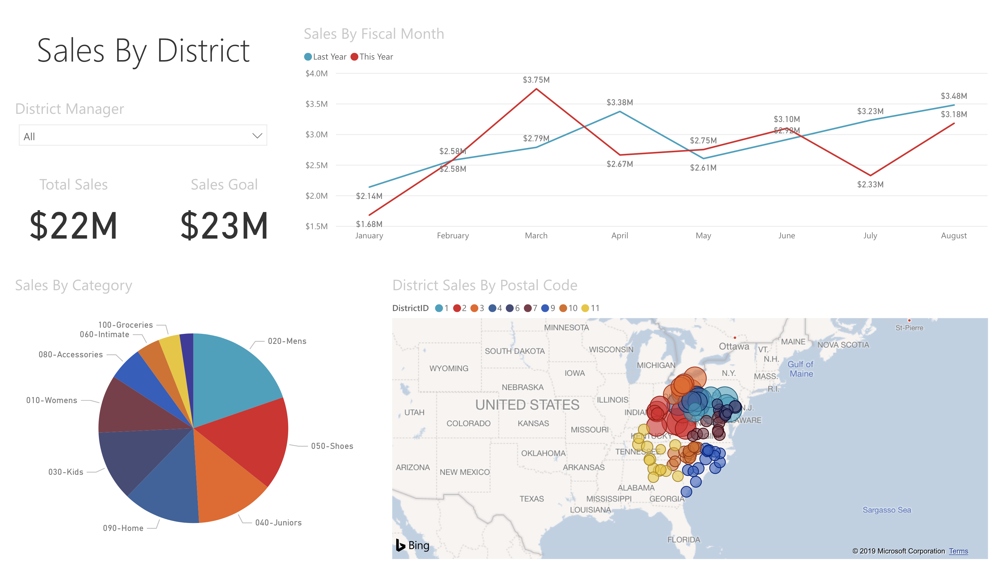

<h1>J.P. Naifeh</h1>

Senior studying Computer Information Systems at The University of Tulsa!

  
 
<h3> Tech Skills Resumé</h2>

GitHub

 <ul>
   Completed Courses: <b>First Day on GitHub</b> & <b>First Week on GitHub</b>
   <h2>Topics Covered</h2>
  <ul>
  <li>Getting Ready for PowerShell</li>
  <li>Discovering and Getting Help</li>
  <li>Extending Your Capabilities with PowerShell</li>
  <li>Using the Power of the Pipeline</li>
  <li>Getting More Out of Objects</li>
  <li>Scripts and Automation</li>
  <li>Scalable Management with PowerShell Remoting</li>
 </ul>
 </ul>
   

Microsoft Power BI

 <ul>
  Completed Course: <b>Microsoft: DAT207x Analyzing and Visualizing Data with Power BI</b>
       <a href="Course | DAT207x | edX.pdf">Course Verification (Audit Track)</a>
  <h4>Topics Covered</h4>
   <ul>
    <li>Understanding key concepts in business intelligence, data analysis, and data visualization</li>
    <li>Importing your data and automatically creating dashboards from services such as Marketo, Salesforce, and
 Google Analytics</li>
    <li>Connecting to and importing your data, then shaping and transforming that data</li>
    <li>Enriching your data with business calculations</li>
    <li>Visualizing your data and authoring reports</li>
    <li>Scheduling automated refresh of your reports</li>
    <li>Creating dashboards based on reports and natural language queries</li>
    <li>Sharing dashboards across your organization</li>
    <li>Consuming dashboards in mobile apps</li>
    <li>Leveraging your Excel reports within Power BI</li>
    <li>Creating custom visualizations that you can use in dashboards and reports</li>
    <li>Collaborating within groups to author reports and dashboards</li>
    <li>Sharing dashboards effectively based on your organization’s needs</li>
    <li>Exploring live connections to data with Power BI</li>
    <li>Connecting directly to SQL Azure, HD Spark, and SQL Server Analysis Services</li>
    <li>Introduction to Power BI Development API</li>
    <li>Leveraging custom visuals in Power BI</li>
    </ul>
   
  The following Report was created to demonstrate only a few of the various visualizations available in Microsoft Power BI. 
   
  The live version of this report can be accessed <a href="https://app.powerbi.com/groups/me/reports/cedca670-45a7-468b-abc7-ef6e0074448f?ctid=d4ff013c-62b7-4167-924f-5bd93e8202d3">here</a>.
   
  A video overview of this dashboard may be viewed <a href="https://youtu.be/bMBHaFjhzdA">here</a>.
 </ul>

PowerShell

 <ul>
  Completed Course: <b>PowerShell by LinkedIn Learning</b>
   
   
PowerShell is the must-have tool for Windows system administrators. Jump-start your career, and your IT environment, by getting up and running with the latest version, PowerShell 5. Jason Helmick shows you how to get a hand from the help system, extend PowerShell with modules and snap-ins, harness the power of the PowerShell pipeline, and script and automate common administrative tasks. Plus, learn how to take advantage of one of PowerShell's most exciting features, remote management, which can put thousands of machines at your beck and call.
   <h2>Topics Covered</h2>
  <ul>
   <li>Installing Windows Management Framework 5</li>
   <li>Running commands (cmdlets)</li>
   <li>Discovering commands</li>
   <li>Understanding cmdlet syntax</li>
   <li>Resolving terse commands</li>
   <li>Finding and using local modules</li>
   <li>Working with files, printers, CSVs, and XML in the pipeline</li>
   <li>Selecting, sorting, and filtering object data</li>
   <li>Creating scripts</li>
   <li>Automating tasks</li>
   <li>Using PowerShell remoting</li>
 </ul>
 </ul>
   

Salesforce

 <ul>
  Completed Course: <b>Salesforce Admin Beginner Course by Trailhead</b>
   
   
PowerShell is the must-have tool for Windows system administrators. Jump-start your career, and your IT environment, by getting up and running with the latest version, PowerShell 5. Jason Helmick shows you how to get a hand from the help system, extend PowerShell with modules and snap-ins, harness the power of the PowerShell pipeline, and script and automate common administrative tasks. Plus, learn how to take advantage of one of PowerShell's most exciting features, remote management, which can put thousands of machines at your beck and call.
   <h2>Topics Covered</h2>
  <ul>
   <li>Getting started with Salesforce</li>
   <li>Understanding the architecture</li>
   <li>Data modeling</li>
   <li>Data management (import/export)</li>
   <li>Customizing the Lightning Experience</li>
   <li>Working with the mobile app</li>
   <li>Engaging users</li>
   <li>Working with reports and dashboards</li>
 </ul>
 </ul>
   

 
