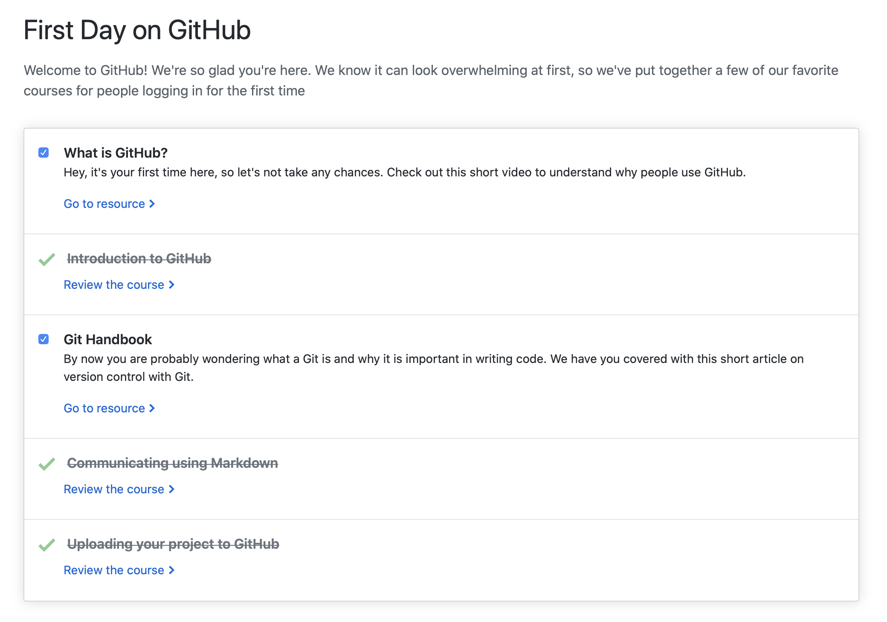

<h1>J.P. Naifeh</h1>

The following is an overview of the technical training and certifications that I have completed while a student at The University of Tulsa! I am currently a Senior pursuing a B.S.B.A. in Computer Information. Anticipated Graduation: Spring 2020.

 
<h2>Tech Skills Resumé</h2>

GitHub

 
The First Day and First Week on GitHub training courses are designed to introduce new users to GitHub. Starting with the very basics and on through GitHub Pages and pull requests, these trainings provide the necessary basics to start using GitHub.

 <h4>Courses Completed</h4> 
  <ul>
   <li><a href="https://lab.github.com/githubtraining/paths/first-day-on-github">First Day on GitHub</a></li>
   <li><a href="https://lab.github.com/githubtraining/paths/first-week-on-github">First Week on GitHub</a></li>
  </ul>
  <h4>Topics Covered</h4>
  <ul>
   <li>Getting Started with GitHub</li>
   <li>Communicating with Markdown</li>
   <li>Uploading a project to GitHub</li>
   <li>Working with GitHub Pages</li>
   <li>Reviewing pull requests</li>
   <li>Managing merge conflicts</li>
   <li>Securing workflows</li>
  </ul>
 <h4>Course Completion Verification</h4>
 

Microsoft Power BI

 
Microsoft Power BI is a business intelligence suite that enables working with extremely large datasets. In this training course, large datasets were imported into Power BI and visualized in several ways. Below is a link to a video overview of the dashboard I created as part of this course.

 <h4>Course Completed</h4> 
 <ul>
  <li><a href="https://courses.edx.org/courses/course-v1:Microsoft+DAT207x+1T2017/course/">Microsoft: DAT207x Analyzing and Visualizing Data with Power BI</a></li>
 </ul>
 <h4>Topics Covered</h4>
 <ul>
  <li>Understanding key concepts in business intelligence, data analysis, and data visualization</li>
  <li>Importing your data and automatically creating dashboards from services such as Marketo, Salesforce, and
 Google Analytics</li>
  <li>Connecting to and importing your data, then shaping and transforming that data</li>
  <li>Enriching your data with business calculations</li>
  <li>Visualizing your data and authoring reports</li>
  <li>Scheduling automated refresh of your reports</li>
  <li>Creating dashboards based on reports and natural language queries</li>
  <li>Sharing dashboards across your organization</li>
  <li>Consuming dashboards in mobile apps</li>
  <li>Leveraging your Excel reports within Power BI</li>
  <li>Creating custom visualizations that you can use in dashboards and reports</li>
  <li>Collaborating within groups to author reports and dashboards</li>
  <li>Sharing dashboards effectively based on your organization’s needs</li>
  <li>Exploring live connections to data with Power BI</li>
  <li>Connecting directly to SQL Azure, HD Spark, and SQL Server Analysis Services</li>
  <li>Introduction to Power BI Development API</li>
  <li>Leveraging custom visuals in Power BI</li>
 </ul>
 <h4>Course Completion Verification</h4>
 <ul>
  <li><a href="Course | DAT207x | edX.pdf">Verification of Course Completion (Audit Track)</a></li>
 </ul>
  
 <h4>Power BI Sample Implementation</h4>
  
The following report was created to demonstrate a few of the various visualizations available in Microsoft Power BI.
 
   
  
The live version of this report can be accessed <a href="https://app.powerbi.com/groups/me/reports/cedca670-45a7-468b-abc7-ef6e0074448f?ctid=d4ff013c-62b7-4167-924f-5bd93e8202d3">here</a>.
   A video overview of this dashboard may be viewed <a href="https://youtu.be/bMBHaFjhzdA">here</a>.
 

Linux

 
The LPI Linux Essentials training explains the basics of Linux and builds up to cover the topics necessary to complete the LPI Linux Essentials Certification. The training included various hands-on labs where students could SSH into a Linux machine and complete various tasks using the command line. This course was completed in preparation for completing the LPI Linux Essentials Certification.

 <h4>Course Completed</h4>
 <ul>
  <li><a href="https://linuxacademy.com/course/lpi-linuxessentials/">LPI Linux Essentials</a></li>
 </ul>
 <h4>Topics Covered</h4>
 <ul>
  <li>Getting started with Linux</li>
  <li>Open-source software</li>
  <li>Using the command line</li>
  <li>Working with and archiving files</li>
  <li>Data storage</li>
  <li>Users, groups, and permissions</li>
 </ul>
 <h4>Course Completion Certificate</h4>
    
  
 <h4>Linux VPN Implementation</h4>
 
In addition to the LPI Linux Essentials training, I also set up a Virtual Private Network (VPN) utilizing Digital Ocean hardware running Ubuntu 19.04. Below is a screenshot verifying my installation.

 

AWS

  <h4>Course Completed</h4> 
  <ul>
   <li><a href="https://linuxacademy.com/course/aws-essentials-new/">AWS Essentials</a></li>
  </ul>
  <h4>Topics Covered</h4>
  <ul>
   <li>Getting started with AWS</li>
   <li>IAM</li>
   <li>Virtual Private Cloud (VPC)</li>
   <li>Elastic Cloud Compute (EC2)</li>
   <li>Storage Services</li>
   <li>RDS and DynamoDB</li>
   <li>Monitoring, Alerts, and Notifications</li>
   <li>Load Balancing, Elasticity, and Scalability</li>
   <li>Lambda (Serverless Compute)</li>
 </ul>
 <h4>Course Completion Certificate</h4>
 

 

PowerShell

 
PowerShell is a powerful tool used by network administrators to work with Windows machines and automate network management tasks. This training discussed commands, automation, scripting, working with the PowerShell pipeline, and many other useful topics.

 <h4>Course Completed</h4> 
 <ul>
  <li><a href="https://www.linkedin.com/learning/powershell-5-essential-training/installing-the-windows-management-framework-5?autoplay=true&trk=learning-course_table-of-contents_video&upsellOrderOrigin=default_guest_learning">PowerShell 5 Essentials</a></li>
 </ul>
 <h4>Topics Covered</h4>
  <ul>
   <li>Installing Windows Management Framework 5</li>
   <li>Running commands (cmdlets)</li>
   <li>Discovering commands</li>
   <li>Understanding cmdlet syntax</li>
   <li>Resolving terse commands</li>
   <li>Finding and using local modules</li>
   <li>Working with files, printers, CSVs, and XML in the pipeline</li>
   <li>Selecting, sorting, and filtering object data</li>
   <li>Creating scripts</li>
   <li>Automating tasks</li>
   <li>Using PowerShell remoting</li>
 </ul>
 <h4>Course Completion Certificate</h4>
 

Salesforce

 
The Admin Beginner course for Salesforce is a series of hands-on labs and quizzes that guide users through various tasks associated with managing a Salesforce installation. The course also allowed access to a fully functional Salesforce account to experiment with various features of the platform.

 <h4>Course Completed</h4> 
 <ul>
  <li><a href="https://trailhead.salesforce.com/en/content/learn/trails/force_com_admin_beginner">Salesforce: Admin Beginner Course</a></li>
 </ul>
 <h4>Topics Covered</h4>
 <ul>
   <li>Getting started with Salesforce</li>
   <li>Understanding the architecture</li>
   <li>Data modeling</li>
   <li>Data management (import/export)</li>
   <li>Customizing the Lightning Experience</li>
   <li>Working with the mobile app</li>
   <li>Engaging users</li>
   <li>Working with reports and dashboards</li>
 </ul>
 <h4>Course Completion Verification</h4>
  

